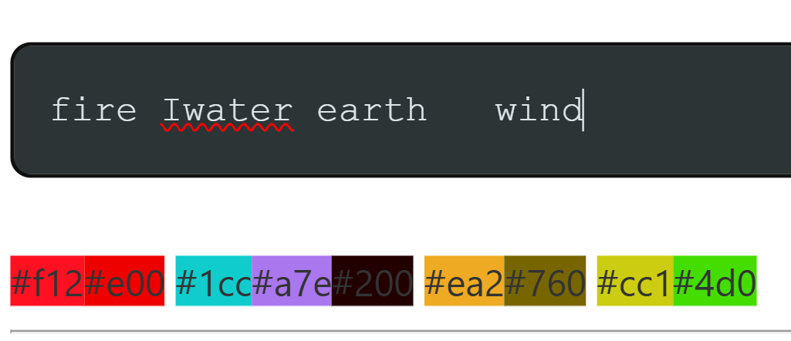

# Hexspell

A human-readable hexadecimal encoding system for text that creates a good secret language while maintaining readability (even in otherwise unreadable binary data displayed as hexadecimal stream).

Best is, you just try out the [live demo](https://dragon-17.github.io/hexspell/) or you can use the no-install CLI described below.
Alternativly this `readme.md` contains a rough rundown of hexspell.


## Simple Introduction via Leetspeak
If you now what Leet speak is, you can skip to **# Overview**.

The brain of most humans can still read obfuscate symbols that only vaguley resemble a known letter (e.g. some people handwrittings) with the same speed as normal text.
There have been various 'encodings' using this effect on the internet to make text look visually more pleasing (especially on old bullet-in board w/o things like emojies/sticker/plain images). It is also used to make text harder to read for outsiders ( `you noob` => `y0u n00b`) or to circumvent automatic content-filter (`idiot => 1d1o7`).
Such 'encodings' replace for example letter with numbers that look similar (`3 => E` and `5 => S`).
Here is a famous example of Leet speak from the internet. Try to read it:

    7H15 M3554G3 5ERV35 70 PR0V3        #Help: THIS MESSAGE SERVES
    H0W 0UR M1ND5 C4N D0 
    4MaZ1NG 7H1NG5!
    1MPR3551V3 7H1NG5!
    1N 7HE B3G1NN1NG 17 W45 H4RD
    BU7 N0W, 0N 7H15 L1N3,
    Y0UR M1ND 15 R34D1NG 17 4U7T0M71CLLY
    W17H0U7 3V3EN 7H1NK1NG 4B0U7 17.
    B3 H4PPY, 7H47 Y0U C4N R34D 7H15, 
    1 H4V3 S33N P30PL3 7H47 C4NN07.

Hexspell goes even **further**. It uses only the 16 hexadecimal to encode all characters while still being readable.
For an overall better mapping it uses only smaller case letters, fitting for the englisch language, which also uses mostly lower-case.
Also, it does not use the common `3 => E` or `4 => A`, because hexadecimal has the letter a-f already.
Here is the same text in hexspell. You can try read it now or, if you have trouble, you can first read the mapping tables in **# Encoding System**:

    7615 44e5a9e 5e2ce5 70 620ce        #Help: this message serves
    60cc 0c2 4414d ca4 d0
    a44a2149 76149  3E
    14 76e be914419 17 cca5 6a2d
    bc7 40cc  3b  04 7615 184e  3b
    90c2 4414d 15 2ead149 17 ac7044a71c119
    cc1760c2 efde4 7614b149 ab0c7 17  3b
    be 6a669  3b  76a7 90c ca4 2ead 7615  3b
    1 6afd 5ee4 6e061e 76a7 ca4407 3b

## Overview

Hexspell is a creative take on hexadecimal encoding, inspired by concepts like [hexspeak](https://en.wikipedia.org/wiki/Hexspeak) (e.g., `0xcoffee`, `0xdeadbeef`) or leetspeak (prev. §) but extended to encode all characters. It uses a 4-bit encoding system combined with special combos and escape sequences for complete character coverage.

**Key Benefits:**
- Human-readable hex encoding - easier to work with/read in hex editor than binary:

        TXT:      test?! abc 1 2 3
        ASCII:    74 65 73 74 3f 21 61 62 63 20 31 20 32 20 33 
        Hexspell: 7e 57 3f 3e 00 ab c0 03 10 03 20 03 3
        (*Note:* hexspell is a 4bit format with some 8bit combos, so a display of 4bits instead of common 1byte display is more readable)

- Compact representation - shorter than ASCII when saved as binary
- Bidirectional conversion - Web-App/API can both encode text to hex and decode hex back to text
- Secret language application - obfuscate text in a playful way
- Map a hex color to a word or vice versa


Taking a input text you can convert it into a readable hexadecimal stream:

    hello world!
    foobar

    try to read the hexspell, you can do it!

    abra kadabra ta daa!!!

Readable hex output:
    
    6 e 1 1 0 00 cc 0 2 1 d 3E 0000 
    f 88 b a 2 0000 
    0000 
    7 2 9 00 7 0 00 2 e a d 00 7 6 e 00 6 e 3 5 6 e 1 1 3b 00 90c 00 c a 4 00 d 0 00 1 7 3E 0000 
    0000 a b 2 a 00 b a d a b 2 a 00 7 a 00 d a a 3E 3E 3E

Spaces are only for formating, only hex digit determine the content, the 00 encode message space and 0000 encode new lines.
This allows to save a hexspell as a binary data stream without losing any whitespace information.
The following is the same hexspell in its most compact ASCII form. You could read it in a debugger or binary data file diaplayed with `hexdump -C myHexspell.bin`.
You **can** still read it (or decode it programatically):

    6e11000cc021d3E0000f88ba200007290070002ead0076e006e356e113b0090c00ca400d000173E00000000ab2a00badab2a007a00daa3E3E3E

Now, when you save this as a binary stram you only need half the storage size.

>**Tip**: if you search for '00' in a browser or text editor it will highlight all spaces allowing you to see wordboundary without any extra tooling.

You can also interpret the hexspell output as colors, allowing a general mapping of words to colors:



If you can already read hex spell try to read the colors


## Encoding System

### Overview
- **Base Unit:** 4-bit encoding per character (hex digits 0-f)
- **Combos:** Special character combinations for extended coverage
- **Escapes:** Escape sequences (marked with `e5c`) for characters outside the basic set
- **Optimization:** Configurable output formats (readable, compact, etc.)

### Table 1: Basic Hex-to-Character Mapping

| 0 | 1 | 2 | 3 | 4 | 5 | 6 | 7 | 8 | 9 | a | b | c | d | e | f |
|---|---|---|---|---|---|---|---|---|---|---|---|---|---|---|---|
| **o** | **l**, (i) | **r**, z | **x** | **n**, m | **s** | **h**, p | **t** | **i** | **g**, y, j, q | **a** | **b**, k | **c**, u, v, w | **d** | **e** | **f** |

Example: 
    
    7615 00  15 00  a 00  5ec2e7 00  44e55a9e 3b  

    This " " is " " a " " secret " "  message ;

    
    
**Mappings Explained:**
- **0** = 'o' (zero looks like o)
- **1** = 'l' or 'i' (1 looks like lowercase l; use 8 for 'i')
- **2** = 'r' or 'z'
- **3** = 'x' (requires escape marker; or use combo 'bf')
- **4** = 'n' or 'm' (use combo 'd4' for double 'n')
- **5** = 's'
- **6** = 'h' or 'p' (use '6b' combo for 'p', '9f' for 'h')
- **7** = 't'
- **8** = 'i' (the dot above the 8 represents 'i')
- **9** = 'g', 'y', 'j', or 'q' (use '9b' combo for 'qu')
- **a** = 'a'
- **b** = 'b' or 'k' (use '74' combo for 'k')
- **c** = 'c', 'u', 'v', or 'w' (use 'cc' combo for 'w')
- **d** = 'd'
- **e** = 'e'
- **f** = 'f' (or 'fb' for alternate)

### Table 2: Special Escape & Combo Sequences

| Combo | Mapping | Notes |
|-------|---------|-------|
| **cc** | w | Double-u (cc = uu, vv rare, low impact) |
| **fd** | v | f='\' and d='/' → \/ (visual mnemonic) |
| **74** | k | 7='\|' and 4='<' → \|< (looks like k) |
| **9b** | qu | - |
| **6b** | p | Better decodability (pb is rare) |
| **9f** | h | Looks like capital H (optional, use hex 6 instead) |
| **9d** | j | gd, jd are rare |
| **97** | y | gt, jt, yt are rare; '7' matches y's stroke |
| **7b** | z | - |
| **bf** | x | - |
| **00** | (space) | Null byte as space |
| **3a** | : | ESC Enumeration |
| **3b** | ;, . , | ESC Break (general delimiter) |
| **3c** | (control) | Beginning of control code (e.g., 3c7 = tab) |
| **3d** | @ | Interpret next byte as ASCII number/char |
| **3e** | ! | 0x3E is ASCII '>' (read as ESC Exclamation) |
| **3f** | ? | ESC Question mark |
| **30-39**|0-9| The number digits, \x3n are the actual ASCII code for numbers
| **3add** | + | ESC Add |
| **35cb**, **bb** | - | ESC Subtract (bb is shorter) |
| **344c** | * | ESC Multiply (mu) |
| **3d1f** | / | ESC Divide |


## Features

### Web Interface
- **Color-coded display** - Visual highlighting for different character types:
  - Space characters (light gray)
  - Escape sequences (orange)
  - Standard hex values (blue)
  - Mathematical operations (magenta/violet)
  - Error states (crimson)

- **Interactive conversion** - Real-time encoding and decoding
- **Bidirectional option** - Handle ambiguous decodings with dropdown selector
- **Format options** - Various display and encoding formats
- **Download functionality** - Export results as both hex and ASCII formats

### Command-Line Interface
- Headless Chrome integration for CLI usage
- Query parameter API for automated encoding/decoding
- Support for file input/output
- URL encoding support


## Installation

### Requirements
- Google Chrome (or Chromium-based browser)
- You can use the github-page of this repo **without** an install.
- Node.js (optional, for scripting)

### Setup

1. **Web Interface:** Simply open `index.html` in a web browser
   
2. **CLI Setup (Windows):**
   ```
   set HEX_API="file:///C:\Users\<YourUser>\path\to\hexspell\index.html"
   
   # or if you don't want to donwload the index.html
   set HEX_API="file:///C:\Users\<YourUser>\path\to\hexspell\index.html"
   ```

3. **CLI Setup (Linux/Mac):**
   ```
   export HEX_API="file:///path/to/hexspell/index.html"
   ```

## Usage

### Web Interface
1. Open `index.html` in your browser
2. Enter text in the input field to convert to hexspell
3. Or paste hexspell code to decode back to text
4. Use the dropdown for ambiguous decoding options
5. Download results as needed

### Command-Line Interface

**Basic encoding to a hexspell from the command line via query paramenter `text`:**
```bash
# windows  use $envVar and | cat on linux
your/path/to/chrome.exe --headless --dump-dom "%HEX_API%?api&text=Hello+World" | more
```

You can add chrome to your path. Makes it easier and allow more option (screenshots, headless browsing, dom-dump).

**Decode a hex spell via the api and query paramenter `hex`:**
```bash
chrome --headless --dump-dom "%HEX_API%?api&hex=6100cce173d" | more
```

**With options:**
```bash
chrome --headless --dump-dom "%HEX_API%?api=1&esc=1&sameNum=1&readableWS=1&compact=1&hex=6100cce17"
```

**Save to file:**
```bash
chrome --headless --dump-dom "%HEX_API%?api&text=Your+Text+Here" > output.txt
```

**Batch files:** Use `hexspell.bat` (Windows) or `hexspell.sh` (Linux/Mac) for convenient CLI access

**Example no install via githubpages (just execute this in a terminal with internet):**
```bash
chrome --headless --dump-dom "https://dragon-17.github.io/hexspell/?api&hex=40cc0090c00ca400c5e0076e006ebf56e1100a6100f204400efde29cc6e2e3E" | more
```
You can also open this in a browser (but you may need a `keep` parameter to avoid window auto close).
## Examples

The `dump/` folder contains test cases:
- `helloWorld.hex.txt` - Hexspell-encoded "Hello World"
- `star_wars.txt` - Longer text example
- Other test files showing various encodings

## API Query Parameters

- `api` - Enable API mode - the html trims itself to a minimum
- `hex` - Hexspell code to decode
- `text` - Text to encode
- `esc` - Enable escape sequences
- `sameNum` - Keep same number format
- `readableWS` - Make whitespace readable
- `compact` - Compact output format


## Future Ideas

- Custom font for better number display
- Extended character support
- Compression integration
- Visual encoding/decoding tutorial
- Performance optimizations for large texts

## Project Structure

```
hexspell/
├── index.html              # Main web interface
├── hexspell.bat            # Windows batch wrapper
├── hexspell.sh             # Unix shell wrapper
├── CMDL_API_INFO.txt       # CLI usage documentation
├── readme.md               # This file
└── dump/                   # Example encoded texts
└── fonts/                  # Auto d/Encode by using a hexspell-font
```

## License

any Opensource lic

## Inspiration

Inspired by:
- [Hexspeak](https://en.wikipedia.org/wiki/Hexspeak) - Hexadecimal code that looks like words
- [Leetspeak](https://en.wikipedia.org/wiki/Leet) - Creative character substitution
- Esoteric programming language [JSFuck](https://jsfuck.com/). If I *( | you)* have time I create `JSHexFuck`-stenographic-JS-obfuscator where all text must be writen in hexspell, variables and strings are written as hexadecimal and can only contain 0-9a-f:
        
        // 14 18b f81e 
        c04501e3b109 = console.log
        
        // 14 f81e 7e57 3b 0d5
        \u441572149 = [ 0xa11, 5721495, 0x44c57, 0xc5e, 0x6e3, 0xd16175, 0xc419 ]
        \u184417ed572 = `020076e900a2e184417e70070303132343536373839abcdef` 
        c04501e3b109(  \u441572149, \u184417ed572 )
